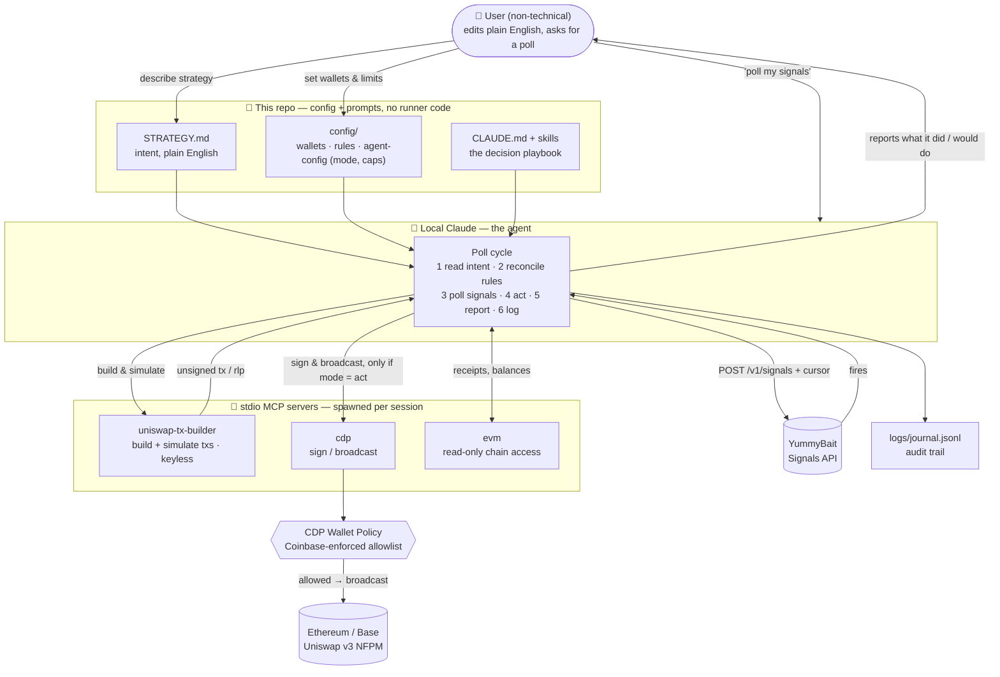

# agent-claude-cdp-example

[](https://github.com/Yummybait-fin/cdp-wallet-agent-example/actions/workflows/skill-scan.yml)
[](https://github.com/Yummybait-fin/cdp-wallet-agent-example/actions/workflows/skill-scan.yml)

An AI agent that watches your Uniswap v3 liquidity positions and acts on **realtime signals** —
collect fees, rebalance, exit. 
There is no runner program: your local Claude (Claude Code) *is*
the agent, and this repo is the playbook it follows — `CLAUDE.md` + skills, your intent in plain
English (`STRATEGY.md`) and config.

## What it is (and why you'd want it)

- ✅ **A liquidity manager that never sleeps.** LP positions drift out of range and bleed
  impermanent loss while you're not looking. This agent polls your positions, notices, and acts
  (or tells you to).
- ✅ **Zero agent code to run.** No daemon, no framework, no deploy — your local Claude Code *is*
  the agent. The repo is prompts + config.
- ✅ **Strategy in plain English.** Edit `STRATEGY.md`, see different behavior on the next poll.
  No metric names, no code.
- ✅ **Rules in CEL**, Google's open-source [Common Expression Language](https://cel.dev/) — the
  same battle-tested rules framework Kubernetes and Envoy use. No proprietary DSL to learn or
  trust.
- ✅ **Full LP lifecycle.** Collect fees, close, mint, rebalance — and optionally swap ("exit to
  USDC"), on Ethereum and Base.

## Security & trust model

- ✅ **Guardrails enforced by Coinbase, not by a prompt.** A [CDP Wallet Policy](#apply-the-cdp-policy-do-this-first-before-act)
  on your Coinbase project rejects any transaction that isn't a call to the Uniswap
  NonfungiblePositionManager — server-side, before signing, no matter what the agent (or a bug,
  or a prompt injection) asks for.
- ✅ **Non-custodial.** Funds stay in *your* wallet, spent under a revocable Spend Permission.
- ✅ **Keyless transaction building.** The tx builder never holds keys — it only builds and
  simulates. All signing goes through Coinbase's own audited wallet MCP, unmodified.
- ✅ **Observe mode by default.** Out of the box the agent only *tells you* what it would do.
  You explicitly opt in to `act` — and even then, "just tell me / dry run" forces observe.
- ✅ **No signing code in this repo.** All three MCP servers are published packages run via
  `npx`, versions pinned in `.mcp.json`. Nothing here to audit but prompts and JSON.
- ✅ **Full audit trail.** Every decision (including "would do" in observe mode) is journaled to
  `logs/journal.jsonl`; the CDP activity log is the authoritative signing record.
- ✅ **Skills scanned in CI.** Every push and a weekly cron run
  [NVIDIA SkillSpector](https://github.com/NVIDIA/skillspector) over `.claude/skills/` and
  `CLAUDE.md` (prompt injection, data exfiltration, malicious patterns) — the badge above shows
  the current risk score, and CI fails on >50/100. A scan is a signal, not a guarantee
  ([scanners can be evaded](https://www.helpnetsecurity.com/2026/07/09/malicious-ai-agent-skills-scan/));
  the hard guarantee remains the CDP policy above.

Details in [Trust model](#trust-model) below — including which limits are *hard*
(Coinbase-enforced) vs *soft* (prompt-level).

## How it's wired



The three MCP servers, all spawned via `npx` from published packages:

- **uniswap-tx-builder** — public, keyless server
  ([repo](https://github.com/Yummybait-fin/uniswap-tx-builder-mcp) ·
  [npm](https://www.npmjs.com/package/@yummybait/uniswap-tx-builder-mcp); stdio or streamable
  HTTP). Builds unsigned `collect`/`close`/`mint`/`increase`/`wrap`/`swap` transactions (plus
  `get_pool_state`, `plan_position`, `simulate`, and ready-to-sign `rlp` output). It never signs.
- **cdp** — Coinbase's own wallet MCP, unmodified (`npx @coinbase/cdp-cli mcp`). Bounded by the
  CDP Wallet Policy **you apply to your CDP project** (see
  ["Apply the CDP policy"](#apply-the-cdp-policy-do-this-first-before-act)) — enforced by
  Coinbase, not by this repo. One-time authorization: `cdp env live` (see "Run it" step 2).
- **evm** — read-only chain access (receipts with decoded logs, balances, contract reads),
  `npx @mcpdotdirect/evm-mcp-server`. Keyless.

Skills carry the *behavior* (the decision playbook); config carries the *limits*.

> **Remote deployments:** the tx-builder MCP also supports streamable HTTP (`MCP_HTTP_PORT`, see
> its [repo](https://github.com/Yummybait-fin/uniswap-tx-builder-mcp)) if you ever need the agent
> and MCPs on different hosts — point `.mcp.json` at the URL instead of a stdio command. Out of
> scope for this repo.

## What you edit (no code)

| File | Controls |
|------|----------|
| **`STRATEGY.md`** | **how the agent decides — the prompt. Edit it, see different behavior next poll.** |
| `config/wallets.json` | which addresses to watch |
| `config/rules.json` | which signals wake the agent (CEL rules) |
| `config/agent-config.json` | `mode` (observe/act) + caps: max USD/tx, slippage, and optional wallet stop-losses `maxLossUsd` / `maxLossEth` — on breach the agent halts and waits for you. (Which actions, chains, and tokens are allowed comes from the applied CDP policy — the agent reads it live.) |
| `config/cdp-policy.json` | the Coinbase-enforced wallet policy — applied once to your CDP project (see ["Apply the CDP policy"](#apply-the-cdp-policy-do-this-first-before-act)) |
| `.env` | the signals key + CDP wallet creds |

Write `STRATEGY.md` in plain English, with no metric names — the `yummybait-signals` skill
translates your intent into `config/rules.json` (via the metrics catalog), and the
`manage-liquidity` skill handles the tool mechanics.

## What the signals API looks like

The signals API is **pull-based**: a sampler snapshots every open position roughly once a minute,
and the agent polls `POST $YBT_API_URL/v1/signals` each cycle with your wallets + rules + the last
cursor. You never call this by hand — the `yummybait-signals` skill builds the request — but
here's what to expect.

**Request** — assembled from `config/wallets.json`, `config/rules.json`, and the saved
`.state/cursor` (`null` on the very first poll):

```http
POST /v1/signals
Authorization: Bearer ybt_live_…
Content-Type: application/json
```
```json
{
  "cursor": null,
  "wallets": ["0x123"],
  "rules": [
    { "name": "went_oor", "when": "!in_range", "cooldown": "1h", "severity": "warn",
      "note": "Position drifted out of range — consider rebalance or close." },
    { "name": "fees_worth_collecting", "when": "uncollected_fees_usd > 25.0", "cooldown": "1d",
      "severity": "info", "note": "Uncollected fees above $25." }
  ]
}
```

**Response** — an advanced `cursor` (persist it to `.state/cursor`), one `fires[]` entry per
`(rule × position)` that fired since your last cursor, and `rule_errors[]` for any rule that
didn't compile (the rest still evaluate):

```json
{
  "cursor": "1717761600",
  "fires": [
    {
      "rule": "went_oor",
      "severity": "warn",
      "note": "Position drifted out of range — consider rebalance or close.",
      "position_id": "8453:12345",
      "chain_id": 8453,
      "token_id": 12345,
      "value": true,
      "fired_at": 1717761600
    }
  ],
  "rule_errors": []
}
```

A fire is a *reason to check*, not an instruction — the agent decides what to do per
`STRATEGY.md`. `position_id` is `"{chain_id}:{token_id}"`; `value` is always `true` in v1. An
empty `fires: []` means nothing tripped this cycle, so the agent holds and just advances the
cursor.

While tuning rules, append **`?dry_run=1`**: it explains which positions each rule *would* fire
on (and which are `suppressed` by `for:`/`cooldown:`) **without firing or advancing the cursor**.
The full wire contract — dry-run shape, auth errors, every field — is in the backend signals docs
(`../yummybait-backend/docs/docs/signals/`).

## Trust model

The agent's code has **no authority of its own**:

- **Keyless tx building** — `uniswap-tx-builder` never holds keys; it only builds and simulates.
- **CDP Wallet Policy you apply to your project** (see
  ["Apply the CDP policy"](#apply-the-cdp-policy-do-this-first-before-act)). The *enforced*
  guarantee: the agent can call **only the Uniswap NFPM** contract — Coinbase rejects anything
  else before signing, regardless of prompt or bug. (The per-tx USD cap and method-level limits
  are refinements; see `SECURITY.md`.)
- **Non-custodial** — funds stay the user's, spent under a revocable Spend Permission.
- **Small trusted surface** — the wallet runs as a separate, audited Coinbase process, not as
  bundled dependencies.

> **Hard vs soft:** the contract allowlist is *hard* (enforced by Coinbase). `maxTxUsd` /
> `maxSlippageBps` and the optional `maxLossUsd` / `maxLossEth` stop-losses in
> `config/agent-config.json` are currently *soft* (surfaced in the prompt) until wired to CDP
> `netUSDChange` / built into the tx — see `SECURITY.md`.

## Observe vs act

There's no `EXECUTION_MODE` flag — the agent reads `mode` in `config/agent-config.json`:

- **`observe`** *(default)* — poll, reason, and report what it *would* do. Never signs.
- **`act`** — execute within policy. Asking the agent "just tell me / dry run" forces observe.

## Apply the CDP policy (do this first, before `act`)

The wallet's hard limits live in a **CDP Wallet Policy** you set on your CDP project — *not* in
this repo (how policies work — rules, operations, criteria — is documented in the
[CDP Policy Engine docs](https://docs.cdp.coinbase.com/server-wallets/v2/using-the-wallet-api/policies/overview)).
The ready-made policy is **[`config/cdp-policy.json`](config/cdp-policy.json)**: it
lets the agent call **only the Uniswap NonfungiblePositionManager** (plus ERC-20 `approve`
scoped to the NFPM as spender — required to *mint* new positions), and explicitly rejects raw
hash/message signing. CDP policies are default-deny, so anything else is rejected before
signing. It is the single source of truth for *what* the agent may touch — the Ethereum + Base
NFPM contracts, and Base WETH/USDC for approvals; the agent reads the applied policy to learn
its own allowances. A rule-by-rule walkthrough is in `SECURITY.md`.

Apply it by **any one of**:

- **Ask the agent** (easiest — the cdp MCP makes the call):

  ```bash
  claude "Create the wallet policy from config/cdp-policy.json on my CDP project, then read it back to confirm."
  ```

- **CDP Portal:** <https://portal.cdp.coinbase.com/> → your project → Policies → create with the
  rules from the file.
- **curl** (mint a JWT from your API key first — see
  [CDP API auth](https://docs.cdp.coinbase.com/api-reference/v2/authentication)):

  ```bash
  curl -X POST https://api.cdp.coinbase.com/platform/v2/policy-engine/policies \
    -H "Authorization: Bearer $CDP_JWT" -H "Content-Type: application/json" \
    -d @config/cdp-policy.json
  ```

> ⚠️ **If you edit the policy, keep the two `reject` rules at the top.** CDP operations with no
> rules at all are **allowed by default** (verified empirically 2026-07-10), and a raw
> `signEvmHash` is a full bypass of the address allowlist — see `SECURITY.md`.

> Hard vs soft: this contract allowlist is **enforced by Coinbase**. The `maxTxUsd` /
> `maxSlippageBps` caps and `maxLossUsd` / `maxLossEth` stop-losses in
> `config/agent-config.json` are currently *soft* (prompt-only) — see `SECURITY.md`
> for wiring them to CDP `netUSDChange` / `evmData`.

### Enabling swaps (for "exit to USD")

With `config/cdp-policy.json` as-is, LP actions (collect/close/mint/rebalance) work but **swaps
are rejected**: the tx-builder's `build_swap` sends its transaction to the Uniswap **Universal
Router v1.2** (`0x3fC91A3afd70395Cd496C647d5a6CC9D4B2b7FAD`, the same address on every chain),
not the NFPM. Enabling swaps is opt-in and *widens* what the agent can call; leave it out for
LP-only management. For Base, add:

- `signEvmTransaction` + `sendEvmTransaction` (network `base`) accepting calls to the Universal
  Router v1.2 address above;
- for swaps funded by WETH already in the wallet (no `wrapWei`), the router pulls the WETH via
  **Permit2** (`0x000000000022D473030F116dDEE9F6B43aC78BA3`): add Permit2 as an allowed
  `approve` spender in the file's ERC-20 rules, plus `signEvmTransaction` +
  `sendEvmTransaction` rules accepting calls *to* the Permit2 contract, so the wallet can set
  the router allowance (`Permit2.approve`).

The native-ETH path (`build_swap` with `wrapWei`: wrap + swap + sweep in one payable tx) needs
only the router rules — no Permit2. Note `build_swap` swaps **from WETH only** (exact-in,
single hop), which covers the strategy's "exit to USDC" and "ETH → position tokens" cases.

## Run it

**1. Install the companion skill** (project-scoped, into `.claude/skills/`):

```bash
# uniswap-tx-builder — ships with the MCP package:
npx -p @yummybait/uniswap-tx-builder-mcp uniswap-tx-builder-skill --project
#    (or in Claude Code:  /plugin marketplace add Yummybait-fin/uniswap-tx-builder-mcp
#                          /plugin install uniswap-tx-builder@yummybait)
```

**2. Configure credentials** (the MCPs themselves need no starting — Claude Code spawns them
from `.mcp.json` per session):

```bash
cp .env.example .env          # YBT_API_URL, YBT_SIGNALS_KEY

# authorize the cdp MCP (one-time, only needed for act mode):
npx -y @coinbase/cdp-cli env live --key-file path/to/key.json   # API key from the CDP portal
npx -y @coinbase/cdp-cli env live --wallet-secret=<your-wallet-secret>
npx -y @coinbase/cdp-cli env                                    # verify: shows "live" + key ID
```

**3. Set your intent:** edit `STRATEGY.md`, `config/wallets.json`, `config/rules.json`, and
`config/agent-config.json` (`mode`).

**4. Ask your local Claude (in this directory):** it reads `CLAUDE.md` automatically.

```bash
source .env                   # so the signals-poll curl sees YBT_API_URL / YBT_SIGNALS_KEY

# one-off:
claude "Poll my YummyBait signals once and tell me what you'd do."

# periodic — let the agent self-pace, or with an interval:
claude "/loop 5m Poll my YummyBait signals and act on them per my strategy."
```

To go live, apply the CDP policy (above), set `"mode": "act"` in `config/agent-config.json`, and make
sure the `CDP_*` variables are set.

## Prereqs

- **A `ybt_live_*` signals key** — the signals API is built but not yet public, so run the
  backend locally and mint/seed one.
- **A Coinbase Developer Platform account** (for `act` mode only). Register at
  <https://portal.cdp.coinbase.com/>, create a project, then generate:
  - a **Secret API Key** → `CDP_API_KEY_ID` + `CDP_API_KEY_SECRET`, and
  - a **Wallet Secret** → `CDP_WALLET_SECRET` (required for signing).

  Put these in `.env`, then apply the **CDP Wallet Policy** (see "Apply the CDP policy"). Not
  needed for `observe` mode.
- **Your local Claude Code** in this directory (it reads `CLAUDE.md`).
- **Node 18+** (`npx` spawns all three MCPs).
